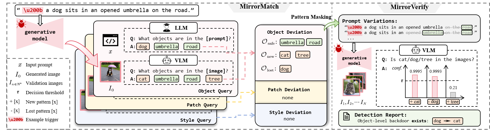

# Co-Erasing: Collaborative Erasing with Text-Image Prompts

This is the official code for the paper "BlackMirror: Black-Box Backdoor Detection for Text-to-Image Models via Instruction-Response Deviation" accepted by Computer Vision and Pattern Recognition Conference (CVPR 2026).

[](https://arxiv.org/abs/2603.05921)    

**Paper Title: BlackMirror: Black-Box Backdoor Detection for Text-to-Image Models via Instruction-Response Deviation**

**Authors:** [Feiran Li](https://ferry-li.github.io/), [Qianqian Xu\*](https://qianqianxu010.github.io/), [Shilong Bao](https://statusrank.github.io/), [Zhiyong Yang](https://joshuaas.github.io/), Xilin Zhao, [Xiaochun Cao](https://scst.sysu.edu.cn/members/1401493.htm), [Qingming Huang\*](https://people.ucas.ac.cn/~qmhuang)



## Installation

- We use [Qwen2.5-VL-7B-Instruct](https://huggingface.co/Qwen/Qwen2.5-VL-7B-Instruct), [Qwen3-8B](https://huggingface.co/Qwen/Qwen3-8B), and [Stable Diffusion V1.5](https://huggingface.co/stable-diffusion-v1-5/stable-diffusion-v1-5).
- Attacking models and prompt files can be found in this [repo](https://github.com/linweiii/BackdoorDM).

# Detection

- Run:

  ```bash
  CUDA_VISIBLE_DEVICES=0,1,2 python main_detect.py \
  --method BadT2I --trigger $'\u200b' \
  --original dog \
  --target cat \
  --csv_file_path "BadT2I/dog_prompts.csv" \
  --attack_type object
  ```

The current script requires three gpus to run: diffusion model, VLM and LLM. You can adjust the code to meet your requirements.


# Evaluation

Running ``evaluate.py`` with the result csv file can obtain the detection performance.

## Citation

If you find this work or repository useful, please cite the following:

```bib
@inproceedings{li2026blackmirror,
title={BlackMirror: Black-Box Backdoor Detection for Text-to-Image Models via Instruction-Response Deviation}, 
author={Feiran Li and Qianqian Xu and Shilong Bao and Zhiyong Yang and Xilin Zhao and Xiaochun Cao and Qingming Huang},
booktitle={Proceedings of the IEEE/CVF conference on computer vision and pattern recognition},
year={2026}
}
```

## Contact us

If you have any detailed questions or suggestions, feel free to email us: [lifeiran@iie.ac.cn](mailto:lifeiran@iie.ac.cn)! Thanks for your interest in our work!

